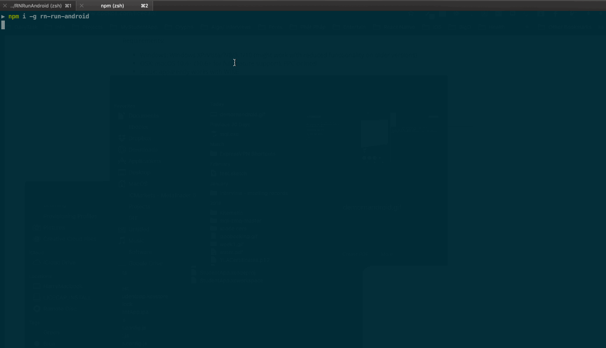

# rn-run-android

No more pain when running react-native app in android emulator. Very similar to `react-native run-ios`: just `rn-run-android` for everything with more advance options.

## Demo



## Installation

```sh
$ npm i -g rn-run-android
```

## Usage

```sh
# Run in the directory of your react-native project
$ rn-run-android

# Available options:
-d, --default     Auto select first created emulator
-w, --writable    Enable -writable-system mode for emulator
-n, --nosnapshot  Enable -no-snapshot-load mode for emulator
-h, --help        output usage information

# Example:
# This command below will select first created emulator and run it with no-snapshot config:
rn-run-android -d -n
```

Inspired by [react-native-run-android](https://github.com/nickpisacane/react-native-run-android)

MIT License
Copyright (c) 2019 Harry Nguyễn
